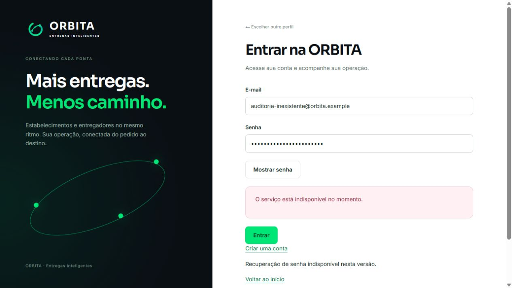

# ORBITA — nova auditoria e correções

Revisão concluída a partir das verificações de 09 e 10/10/2026, horário de Brasília. Complementa [a auditoria de 08/10](AUDITORIA-2026-10-08.md), sem reapresentar testes antigos como novas evidências.

**Conclusão: o projeto tem uma base operacional local, mas ainda não está pronto para entregas com dinheiro real.** O frontend está público; o login publicado retorna HTTP 503 por backend indisponível. Pagamentos são apenas lançamentos contábeis. Há também pendências de distribuição móvel, alertas em segundo plano, recuperação e infraestrutura.

## Escopo e evidências

- Backend NestJS, painel Next.js e app Expo/React Native existentes, suas configurações, testes e documentação.
- GitHub dos repositórios backend/frontend, execução do CI e proteção das branches.
- Configuração autorizada do projeto Vercel `orbita-frontend` e acesso anônimo ao domínio público.
- Pagamentos: rastreamento de carteira/ganhos/cobrança, documentação oficial dos provedores e plano em [Pagamentos e chaves](PAGAMENTOS-E-CHAVES.md).
- Sem acesso autenticado à EC2 nesta rodada, sem teste físico Android/iPhone, sem transação financeira real e sem teste de carga. Não é um pentest exaustivo nem certificação de conformidade.

Versões de entrada: backend `e0bf54b`, frontend `a82a4b8`, mobile `948ec80`. As correções desta revisão são identificadas pelo commit que acompanha este documento.

## Publicação: resultado observado

A exigência **Require Log In** da Vercel foi desativada apenas no projeto ORBITA, após confirmação do usuário. Tanto o [domínio canônico](https://orbita-frontend-phi.vercel.app/login) quanto o endereço do deployment gerado retornaram HTTP 200 sem autenticação Vercel. O domínio de produção já é distinto do endereço gerado: a proteção anterior do endereço gerado, isoladamente, não comprovava que o domínio canônico estava bloqueado.

Uma tentativa com credenciais fictícias no domínio canônico retornou:

```json
{"status":503,"code":"BACKEND_UNAVAILABLE"}
```

A mensagem no navegador foi “O serviço está indisponível no momento”. A rejeição de origem/CSRF do relatório anterior não se reproduziu nessa tentativa. Isso não comprova login real: a API não foi alcançada pelo frontend publicado.



Na configuração Vercel inspecionada, `APP_URL` foi configurada para produção; não foram encontradas as outras variáveis de conexão necessárias. O código exige `FRONTEND_REDIS_URL` e `SESSION_ENCRYPTION_KEY`, e `BACKEND_API_URL` ausente recai em localhost, que não aponta para a EC2. `NEXT_PUBLIC_WS_URL` também precisa apontar para a API pública.

O bootstrap AWS versionado expõe somente `health/live` antes de domínio/TLS, retornando 503 nas outras rotas. Esse é um achado no arquivo, não uma medição da EC2 atual. Fontes: `deploy/aws/bootstrap.sh`, `deploy/aws/README.md`, frontend `src/lib/server/backend.ts:12` e `src/lib/server/session.ts:34`.

## Defeitos encontrados e corrigidos nesta revisão

| ID | Prioridade | Defeito e impacto | Correção e evidência |
| --- | --- | --- | --- |
| R01 | P1 | Digitar endereço convertia latitude/longitude vazias em `(0,0)` e confirmava o destino sem escolha. Alterações de texto também podiam reutilizar um ponto anterior. | Exigir coordenadas completas e confirmação explícita; invalidar destino ao editar; sincronizar seleção; cinco testes de regressão. Frontend `src/features/orders-address/address-field.tsx`. |
| R02 | P2 | Cadastro guardava identidade da primeira etapa; uma sessão trocada em outra aba podia continuar com a identidade antiga e cookies novos. | Consultar identidade atual antes de criar empresa/unidade; rejeitar conta/vínculo alterado ou sessão expirada. Dois testes novos em `tests/registration-resume.test.tsx`. Backend continua responsável pela autorização de cada operação. |
| R03 | P2 | Autenticação rodava antes do limite: requisições 401/403 podiam fazer trabalho de autenticação sem consumir a cota. | Teto pré-autenticação por origem, seguido de autenticação e cotas por ator. Testes HTTP verificam rejeições, atores distintos no mesmo BFF, proxy confiável, XFF falso e Redis indisponível. Backend `src/common/rate-limit.guard.ts`, `src/app.module.ts`. |
| R04 | P1 | Duas confirmações concorrentes da mesma entrega podiam causar erro de unicidade em DeliveryProof, embora uma confirmação já tivesse concluído. | Atualizar Delivery dentro da transação antes de inserir prova. Snapshot obsoleto gera retry de serialização e passa a observar DELIVERED. Teste de corrida usa locks reais do PostgreSQL e verifica prova, ganho e evento únicos. Backend `src/deliveries/deliveries.service.ts`, `test/integration/logistics.spec.ts`. |
| R05 | P2 | Teste de readiness esperava HTTP 200 sem preparar heartbeat, dependendo de worker externo ou ordem de suítes. | Fixture no Redis isolado verifica ausência, expiração e heartbeat atual. Health continua retornando 503 quando worker está indisponível. `test/integration/auth-tracking.spec.ts`. |
| R06 | P3 | Modal do PIN prometia que consulta nunca altera código, mas recuperação de registros legados pode substituí-lo. Instruções do backend estavam em inglês. | Texto informa possibilidade de substituição e resposta explica quando isso ocorreu; instruções privadas traduzidas. Frontend `customer-code.tsx`, backend `deliveries.service.ts`. |

O limite pré-autenticação é um teto compartilhado de 6.000 requisições/minuto por origem. As cotas usuais continuam por ator/endpoint. Ainda é necessário medir tráfego agregado do BFF; não equivale a proteção ilimitada contra DDoS. `TRUST_PROXY_CIDRS` deve conter somente proxies controlados.

## Pendências para operar

| ID | Prioridade | O que falta | Critério de conclusão |
| --- | --- | --- | --- |
| P01 | P1 | API HTTPS, proxy HTTP/WebSocket, worker e configuração de sessões entre Vercel/API. Login publicado retorna 503. | Login, refresh e logout reais; estabelecimento cria pedido e motoboy conclui entrega pela interface pública. Redis autenticado/TLS, sem abrir Redis da EC2 indiscriminadamente. |
| P02 | P1 para pagamentos | Cobrança, recebimento, conciliação e repasse bancário ainda inexistentes. `REAL_PAYMENTS_ENABLED=true` impede startup de propósito. | Gateway homologado, webhooks autenticados/idempotentes, estados financeiros separados e testes completos descritos em PAGAMENTOS-E-CHAVES.md. |
| P03 | P1 para operação real | Mapas de produção e endereço da API nos builds. Bootstrap usa mapas simulados; produção exige Google. | Routes API/Geocoding habilitados e restritos; testar endereços e estimativas reais, limites de consumo e falhas do provedor. |
| P04 | P1 para recuperação | Backup externo e restauração de banco/documentos/chaves não demonstrados; volumes ficam na mesma EC2. | Restaurar cópia em ambiente isolado; definir perda de dados/tempo de recuperação aceitáveis e responsável. |
| P05 | P1 para app em segundo plano | Ofertas são consultadas somente com `AppState` ativo; não há push. GPS em segundo plano não é um aviso de oferta. | Notificação de nova oferta e expiração correta com tela bloqueada; teste físico de permissões, bateria e reconexão. Mobile `src/state/driver-context.tsx:88`. |
| P06 | P1 para iPhone externo | Sem projeto EAS vinculado, IPA assinado ou instalação validada. Mobile ainda sem remote Git; APK existente é anterior ao código atual. | Repositório remoto definido, API HTTPS, assinatura/build identificável por commit e teste no aparelho. `orbita-motoboy/docs/IOS.md`. |
| P07 | P2 | Recuperação de senha esquecida e verificação de e-mail não implementadas. Suporte precisa de destino operacional. | Recuperação com token de uso único/expiração, limites e encerramento de sessões; suporte acessível ao usuário. |
| P08 | P2 | Mobile mantém 18 alertas altos e zero críticos na auditoria de produção. CI falha apenas em critical, permitindo qualquer novo high. | Triagem por advisory e caminho explorável, correções compatíveis ou exceções específicas com prazo; build nativo validado. |
| P09 | P2 | Sem E2E operacional de navegador no CI; branches `codex/production` de backend/frontend consultadas estão sem proteção. | Checks aprovados e obrigatórios, E2E sem obter PIN diretamente por API de teste, promoção/rollback definidos. |
| P10 | P2 | Extrato/ganhos ordenados por UUID aleatório, limitados a 50; lançamentos recentes podem ficar fora da primeira página. | Ordenar por data e desempate estável; validar paginação sem omissões/duplicações. Backend `src/finance/finance.service.ts:43` e `:59`. Não corrigido nesta rodada. |
| P11 | P2 | Solicitações de privacidade apenas criadas/listadas, sem processamento/conclusão. | Fluxo operacional de atendimento, responsáveis e evidência de execução. `src/users/privacy.controller.ts`. |
| P12 | P2 | Monitoramento, capacidade, custo real AWS e restauração/rollback ainda não demonstrados. | Alertas de API/worker/filas/disco/GPS, carga representativa e orçamento acompanhado. Não presumir gratuidade de EC2/IP/disco. |

**Finanças:** `SettlementService` debita o estabelecimento e credita o motoboy no ledger, sem consultar recebimento externo ou limite de crédito. Logo, saldo positivo do motoboy não é saldo bancário disponível. Taxa de espera é registrada com `applied=false`; a regra de cobrança ainda requer decisão comercial. Os componentes financeiros web/app avisam que não executam Pix/saques.

**PIN e isolamento:** recuperação privada existe após as alterações anteriores. Listagens de pedidos e rotas usam `deliveryView`, que retira hash e ciphertext do PIN. A conclusão de entrega também limpa ciphertext. Ainda falta demonstrar o ciclo pela interface publicada, incluindo envio privado ao cliente com WhatsApp real ou encaminhamento manual autorizado; funcionamento local não comprova entrega de mensagem.

**Melhorias após estabilizar:** fotos/adicionais/combos no catálogo, filtros de períodos, gestão de equipe, edição administrativa de preços/zonas e relatórios. Não são pré-requisitos para corrigir login ou para um piloto simples de logística.

## Verificação e entrega

Frontend: 103 testes, lint, TypeScript e build de 54 páginas aprovados; componentes revisados com `vercel:react-best-practices`. Mobile: 67 testes reexecutados nesta revisão; nenhuma mudança mobile nesta rodada. Backend: build/lint, 37 testes unitários e 48 de integração com PostgreSQL/PostGIS e Redis locais isolados aprovados. Total: **255 testes**. Isso não equivale a um E2E no domínio público nem a teste nativo no aparelho.

A auditoria de dependências frontend retornou zero alertas; mobile retornou 18 high e zero critical. Contagens são alertas na árvore, não uma quantidade de explorações independentes. Nenhum teste físico foi executado.

Na entrada da revisão, o [CI backend](https://github.com/vinicius201717/orbita-backend/actions/runs/37982844912) havia falhado em R04/R05; 44 de 46 testes de integração passaram naquela execução. Não havia execuções retornadas pelo GitHub Actions do frontend, apesar do workflow ativo. Foi adicionado `workflow_dispatch` ao frontend para permitir execução explícita e conferir o resultado antes de promoção.

Ordem sugerida: **concluir HTTPS/sessões → validar operação publicada → fechar backups/alertas → homologar pagamentos em sandbox → distribuir e testar o app → liberar piloto controlado**. O esquema de cobrança diária é provisório, sujeito à preferência do usuário; nenhuma cobrança foi iniciada.

### Fechamento de validação — 10/10/2026

- Código backend `8ed688f`: [GitHub Actions aprovado](https://github.com/vinicius201717/orbita-backend/actions/runs/38043017010), incluindo migrations no banco isolado, integração e auditoria de dependências. `npm audit --omit=dev` também retornou zero alertas localmente.
- Código frontend `7a79afb`: [GitHub Actions aprovado](https://github.com/vinicius201717/orbita-frontend/actions/runs/38043085039), incluindo lint, tipos, 103 testes e build. Execução disparada manualmente via `workflow_dispatch`; o disparo automático por push continua pendente de comprovação.
- Os commits de código foram enviados para `codex/development` e `codex/production` nos respectivos repositórios, após os checks. Isso **não implanta o backend na EC2** nem fornece as variáveis de conexão ausentes.
- Mobile permanece no commit `948ec80`, sem alterações nesta rodada e sem publicação remota.
- Preview e produção Vercel do frontend `7a79afb` concluídos. O [deployment de produção](https://orbita-frontend-r44b9emf5-vinicius-projects-a0597f91.vercel.app) foi confirmado pelo status do GitHub/Vercel como `success` / “Deployment has completed”, equivalente a READY. Framework: Next.js; duração do build não consultada. No domínio canônico, teste anônimo final retornou página HTTP 200 e login HTTP 503 / `BACKEND_UNAVAILABLE`. Logs de runtime, drains e alertas não foram inspecionados nesta rodada. Configuração da API e sessões continua sendo o bloqueador funcional; build aprovado não comprova operação integrada.
