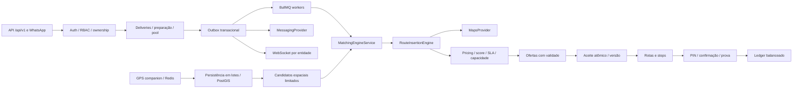

# ORBITA — auditoria e decisões

## Auditoria inicial — 1 de outubro de 2026

O diretório continha apenas `.git`, sem commits, arquivos versionados, aplicação ou instruções `AGENTS.md`. Não havia API nem banco do projeto a preservar. Ferramentas locais: Node 24.11.1, npm 9.7.2, Docker 28.1.1/Compose 2.35.1 e cliente PostgreSQL 16.3. Docker Desktop apresentou falha de inicialização no socket do componente de inferência. Nenhuma configuração ou base do PostgreSQL existente do Windows deve ser modificada.

Stack adotada: NestJS 11, TypeScript 5.9 estrito, Prisma 6.19 fixado, PostgreSQL 16/PostGIS, Redis, BullMQ, Socket.IO, class-validator, Swagger, Jest/Supertest. A escolha de majors fixadas evita uma migração implícita para Prisma 8 ou Nest 12 enquanto o domínio é implementado. O lockfile registra as versões efetivamente instaladas.

## Fluxo e módulos

O matching deve tentar aproveitar rotas existentes antes de formar uma nova rota. Cada entrega é independente; um lote de uma empresa não implica um único motorista. Uma inserção enumera posições de pickup e dropoff, sempre nessa ordem, valida cada trecho da carga e os prazos de todas as entregas.

## Invariantes

- `readinessStatus` é independente de `status`: o pool contém pedidos em preparação, mas a coleta exige `READY_FOR_PICKUP`.
- Dinheiro em centavos inteiros; distâncias em metros; duração em segundos; datas UTC (`timestamptz`). Timezone da filial serve à apresentação.
- Transações serializáveis com retentativa limitada, locks consultivos ordenados e versão de rota protegem aceite, mutação e conclusão. PostgreSQL decide a reserva; Redis não é a autoridade financeira.
- Ledger é append-only, sem saldo mutável como fonte primária. Trigger diferida exige soma zero e pelo menos dois lançamentos. Correção financeira usa contrapartida.
- PIN de quatro dígitos gerado criptograficamente e armazenado como HMAC associado à entrega. Tentativas inválidas são commitadas antes de devolver erro HTTP. Criptografia AES-GCM protege payloads sensíveis persistidos para envio.
- Publicação de eventos é gravada junto da alteração de domínio. Workers podem repetir eventos; consumidores devem manter idempotência. Entrega de mensagem ao provedor é **at least once**, pois um timeout após o provedor aceitar pode gerar reenvio.
- Consultas e projeções aplicam ownership. Uma empresa não recebe o conjunto completo de uma rota compartilhada. Motorista não recebe PIN nem destinos antes de aceitar a oferta.
- GPS usa consentimento, estado operacional, validade e timestamp monotônico. Redis recebe updates; worker persiste snapshot geoespacial e histórico amostrado. Histórico possui retenção configurável.
- Integrações de desenvolvimento são explícitas. Distância simulada não representa trânsito real. Ambiente de produção exige provider de mapas real. Não existe integração de pagamento real neste MVP.

## Plano das fases

| Fase | Escopo | Verificação |
|---|---|---|
| 1 | Auditoria do repositório e ferramentas | Inspeção read-only |
| 2 | Config, Compose, health, ferramentas | Build, lint, testes config, infra real |
| 3 | Schema, migrations, índices, seed | Prisma validate/generate, migrate deploy, seed idempotente |
| 4 | Auth, usuários, empresas, RBAC | Testes login/refresh/ownership |
| 5 | Entregas, preparo, SLA, PIN, prova | Estados/PIN, atomicidade e privacidade |
| 6 | Driver, veículo, GPS, presença e realtime | Consentimento, monotonicidade, TTL e salas |
| 7 | Rotas, stops e versionamento | Ordem, coleta, conclusão e mutações |
| 8 | Mapas, candidatos, inserção e score | Capacidade, SLA, precedência e economia |
| 9 | Ofertas e aceite | Expiração, concorrência real PostgreSQL |
| 10 | WhatsApp, sessão, inbox/outbox | Assinatura, replay, botões e retry |
| 11 | Financeiro | Balanceamento, idempotência e isolamento |
| 12 | Incidentes, espera e cancelamentos | Custódia, devolução, reatribuição |
| 13 | Analytics/admin | Agregações e projeções por tenant |
| 14 | Simulação e integração | E2E e cenário de distribuição |
| 15 | Hardening e documentação | Check completo, auditoria de dependências e limitações |

## Riscos de operação

Precisão GPS e ETA variam; limites de freshness e simulação conservadora reduzem inserções inválidas. A latência e os limites do provedor de mapas exigem candidatos limitados e timeout. Ofertas calculadas com uma versão antiga devem ser recusadas e reavaliadas. WhatsApp exige credenciais, números verificados, consentimento e templates aprovados fora da janela de atendimento. Backups, recuperação pontual, observabilidade externa, gestão de chaves e dimensionamento precisam ser configurados no ambiente de implantação.

Não aplicar `prisma db push` em produção. Toda alteração estrutural deve acompanhar migration, incluindo SQL PostGIS e constraints que Prisma não representa completamente.
